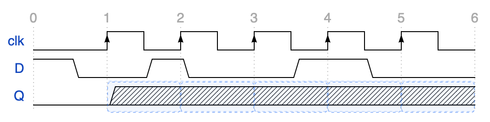

# PrairieLearn OER Element: Waveform

This element was developed as a PrairieLearn OER element. Please carefully test
the element and understand its features and limitations before deploying it in a
course. It is provided as-is and not officially maintained by PrairieLearn, so
we can only provide limited support for any issues you encounter!

If you like this element, you can use it in your own PrairieLearn course by
copying the contents of the `elements` folder into your own course repository.
After syncing, the element can be used as illustrated by the example question
that is also contained in this repository.


## `pl-waveform` element

This element renders digital timing diagrams using the
[WaveDrom library](https://wavedrom.com/) and allows students to fill in auto-gradable signals by toggling
values via click or by entering their values.



### Example

```html
<pl-question-panel>
  <p>Complete the output signal.</p>
</pl-question-panel>

<pl-waveform answers-name="timing" hscale="1.5"></pl-waveform>
```

```python
def generate(data):
    data["params"]["signals"] = [
        {"name": "input", "editable": False, "values": [0, 0, 1, 1, 0, 0]},
        {
            "name": "output",
            "editable": True,
            "start_values": ["0"],
            "values": [0, 1, 1, 0, 0],
        },
    ]
```

### Element Attributes

| Attribute | Type | Description |
|-----------|------|-------------|
| `answers-name` | string (required) | Unique identifier for the element. Student answer keys are namespaced with this value. |
| `weight` | integer (default: `1`) | Weight applied to each editable cell during grading. |
| `hscale` | float (default: `1.5`) | WaveDrom horizontal scale factor. |
| `signals-param` | string (default: `"signals"`) | Key in `data["params"]` containing the signal data as a list (see below). |
| `feedback` | string (default: `"cell"`) | Granularity for feedback given to students: `"cell"`, `"row"`, `"element"`, or `"none"`. |
| `input-mode` | string (default: `"toggle"`) | Input mechanism used for student submissions: `"toggle"` or `"text"`. |

### Input Modes and Feedback

The `input-mode` attribute determines whether students input answers as text or by clicking on editable cells to switch the value (or cycle through the signal's `allowed_values`, if applicable). The default is `"toggle"`, but alternatively, the `"text"` setting overlays text boxes on editable cells. We recommend the text input mode for large sets of allowed values (where toggling would be tedious) or for dense plots where each cell is small and clicking it might require some dexterity.

The `feedback` attribute controls the granularity of post-submission feedback that students receive. We recommend giving less fine-grained feedback when allowing multiple submissions to avoid brute forcing.

| Value | Description |
|-------|-------------|
| `"cell"` | Per-cell highlighting and feedback. |
| `"row"` | Per-row highlighting and row score summaries. |
| `"element"` | Single whole-element `N out of X` score overlay. |
| `"none"` | Hide all visual feedback for the element. |


### Signal Data

Signal definitions are stored in `data["params"]` in the key that matches the `signals-param` attribute (see above). Each signal row is a dictionary with at minimum a unique `name` and an `"editable"` key. Signals with `"editable"` set to `True` are filled in by students, and signals with it set to `False` are pre-rendered reference rows.

#### Values

You can define the correct answer, or a pre-rendered signal if `"editable"` is `False`, in the `values` key. It must be a list of strings or integers, although only `0` and `1` are supported as integers. All `values` lists used within the same element must have the same size.

```python
data["params"]["signals"] = [
    {"name": "A", "editable": False, "values": [0, 0, 1, 1]},
    {"name": "B", "editable": True, "values": ["0", "1", "1", "0"]},
]
```

The values `0`, `1`, `x`, and `z` render as ordinary digital states when the row only uses those values. If any value or editable `allowed_values` entry is outside that set, the whole row is rendered as labeled bus boxes, including `0`, `1`, `x`, and `z`.

The element also supports `period` for all rows and `phase` for non-editable rows. These attributes are passed through to WaveDrom. The total row duration (after `period` scaling) must match across rows.

#### Editable Signals

Editable signals use `values` for the answerable segment. They can optionally include fixed context before or after the editable cells with `start_values` and `end_values`. The total size of all three value lists must match that of all other rows within the same element.

```python
data["params"]["signals"] = [
    {"name": "out", "editable": True, "start_values": ["0", "1"], "values": ["1", "0", "1"], "end_values": ["1", "0"]},
]
```

Editable rows can define `period`, but not `phase`. By default, editable rows allow binary values plus every value in the solution `values` list (e.g., `z`, or any bus values). You can customize this and add more allowed values by defining a list of `allowed_values`; this list must include every solution value and cannot contain duplicates. The special string `"hex"` expands to `0` through `F`.

```python
data["params"]["signals"] = [
    {"name": "ternary", "editable": True, "values": ["2", "1", "0", "2"], "allowed_values": ["0", "1", "2"]},
    {"name": "hex", "editable": True, "values": ["A", "B", "C"], "allowed_values": "hex"},
]
```

#### Advanced WaveDrom Syntax

The `values` format above is the recommended authoring interface for those not familiar with WaveDrom's syntax. To use all of WaveDrom's customization abilities or import existing wave drawings, you can also use raw WaveDrom notation. This notation is defined via the `wave` key (and optionally `data` for busses). 

Non-editable rows can only use either `values` **or** `wave`/`data`. Editable rows cannot use `wave`/`data` for the answerable segment; they must use `values`. Their fixed start/end segments may use `start_wave`/`start_data` and `end_wave`/`end_data` when the context needs raw WaveDrom notation.

Advanced WaveDrom-style signal names are also supported. Instead of a string, `name` may be a WaveDrom name array, such as a `tspan` structure, to format the rendered label. For editable rows, answer keys are based on the flattened label text with punctuation replaced by underscores.

```python
data["params"]["signals"] = [
    {"name": "clk", "editable": False, "wave": "lP......"},
    {"name": "addr", "editable": False, "wave": "=.=", "data": ["first", "second"]},
    {"name": ["tspan", ["tspan", {"class": "info h5"}, "DATA"], " ", ["tspan", {"class": "error", "baseline-shift": "sub"}, "out"]], "editable": False, "values": [0, 1]},
    {
        "name": "out",
        "editable": True,
        "start_wave": "=.",       # pre-rendered bus for 2 periods
        "start_data": ["held"],   # pre-rendered bus label
        "values": ["A", "B"],     # correct answer for student-defined segment 
        "allowed_values": "hex",  # allowed inputs for the student-defined segment
        "end_wave": "0.",         # pre-rendered low state for 2 periods
    },
]
```

The `wave` key supports the following WaveDrom syntax:

| Character | Meaning |
|-----------|---------|
| `0` | Low state |
| `1` | High state |
| `.` | Hold previous value |
| `x` | Unknown |
| `z` | High impedance |
| `l`, `h` | Clock low/high |
| `P`, `N` | Positive/negative clock edge |
| `=`, `2`-`9` | Bus value using the next entry from `data` |

For bus values, provide an additional `data` key that contains a list of strings with the bus labels. Note that `.` means that the previous bus is continued while `=`, `2`, `3`, and similar bus-state characters start a new bus, so the number of bus-state characters should match the number of items in `data`.

Other `wave` [syntax](https://wavedrom.com/tutorial.html) may render, but should be used with caution. Advanced keys like `edge` or `node` are not currently supported.
